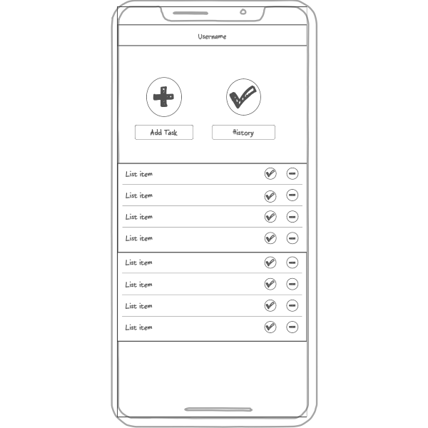

# Startup
Have you ever struggled to keep track of tasks? Do responsibilities get forgotten or missed when working with a group? With the I'm On It application you fears can be put to rest. This application allows individuals to add and complete tasks visible to any others in their group. Each group member or individual can see what tasks have been completed (and by who) and what still needs to be done. I'm On It is perfect for anyone looking to stay organized for themselves, or while working with others! 
## Key Features
- Allow users to create accounts and sign in (Login over HTTPS)
- Display users name 
- Display tasks to do and those completed
- Ability for users to create or delete tasks 
- Update tasks as they are added, completed, or deleted
- Task completion history persistently stored

## Technology 
The following technology will be used in the I'm On It application.

- HTML: Three HTML pages will be used. One for login, for homepage, and task history.
- CSS: application styling that adjusts based on screen size, and uses pleasing color and contrast choices. 
- JavaScript: Provices login, task display, display other user's tasks 
- Service: Backend endpoints to: addTask, updateTask, deleteTask
- WebSocket: Shows who has done what tasks in real time, allows all users to update task list 
- React: Application uses React web framework 

## HTML Assignment 
- HTML pages: Three pages, one that respresent the ability to login, an index and taskhistory
- Tags: properly used the html tags 
- Links: links to login on index page, and link on login to taskhistory
- Text: Each task action is represented by a textual description
- 3rd party service calls: placeholder button for API to google calendar
- Images: Image on index.html
- Login: login placeholder on login.html
- Database data: placeholder for task history list in taskhistory.html
- Websocket: Placeholder showing real time updates on task actions for users logged in 
- Deployed simon to website (https://simon.jascinda.click)
- GitHub: displayed in footer on my login and index htmls 

## CSS Assignment
- Header, footer, main content body: properly styled using CSS fonts, color, and spacing. 
- Navication elements: Styled using fonts, color, and boxed color
- Responsive window sizing: Implemented based on lesson directions for media responsiveness, also made large picture inline formatted
- CSS application elements: proper use of color, shapes, style choices. 
- Text content: aesthetic font that matches headers, spacing, color 
- Image: properly styled using CSS, added border and moved it to the middle
